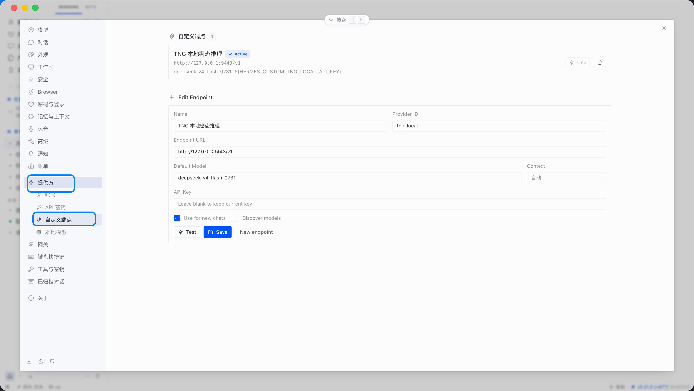

# tngui 可见部分 UI 设计稿

本文档介绍 tngui 桌面客户端界面里每个可见部分的作用，并结合 TNG 的背景概念说明每个状态代表什么、对应的行为是什么。tngui 是 TNG（Trusted Network Gateway）的桌面 GUI 包装器，松耦合于 tng：只通过拉起 `tng launch` 子进程、只读控制面 HTTP 轮询、捕获进程 stdout/stderr 三条契约与 tng 交互，不链接任何 TNG 代码。因此，tngui 自身运行一个内置 HTTP 反向代理作为推理对外入口（默认仅本机 `127.0.0.1`、可切 `0.0.0.0`，见 4 与 5.3 行 1 本机端口）——该反代仍是 tngui 自有进程内服务，不链接 tng 代码。

## 1. TNG 背景概念

为了理解 UI 状态，先简要介绍几个贯穿全文档的 TNG 概念。

### 1.1 Ingress 与 Egress

TNG 把可信网络通信分成两端：

- Ingress：靠近用户侧的入口网关，负责接收本地应用请求，并把请求通过可信通道转发到远端。
- Egress：靠近服务侧的出口网关，负责把可信通道里的请求还原并转给后端服务。

tngui 是客户端侧工具：它启动并管理本机的 tng 进程，只配置客户端 ingress、不承载 egress（egress 属服务侧/网关侧）。客户端 ingress 的"入口形态"描述本机怎样捕获请求；tngui 结构化配置只支持下列两种客户端形态：

| 客户端 ingress 远端类型 | 概念 | 用途 |
|---|---|---|
| 端点映射 | 端口映射 | 把本地请求映射到远端 `<IP>:<端口>`（TNG 约束 host 须为 IP；远端端口必填 `1~65535`） |
| 域名代理 | HTTP 代理 | 应用经 HTTP 代理把流量交给 TNG，远端为主机名 + 可选端口（主机名单文本、端口独立字段，序列化为 `dst_filters=[{domain,port}]`；显式端口须为 `1~65535`） |

TNG 通用能力还提供其它入口模式（透明拦截 / 钩子等非推理用例形态），但 tngui 客户端不暴露、不配置。两种形态下 ingress 到 egress 的业务流量均走 OHTTP 封装（见 1.3）。 tngui 在本机只以一个内置反向代理对外暴露推理入口（默认 `127.0.0.1`、可切 `0.0.0.0`，见 5.3 行 1），tng 的 ingress 本地监听端口仅 `127.0.0.1` 可达、由 tngui 启动时注入、不由用户配置——客户端只连反代、不直连 tng ingress（见 3.3、4）。

### 1.2 控制面与探针

tng 本地控制面是一个只读 REST 接口，默认绑定 `127.0.0.1`。tngui 轮询以下端点：

- `/livez`：存活探针，表示控制面本身是否在线。
- `/readyz`：就绪探针，表示已注册服务是否准备完成。
- `/status/`、`/status/ingress/`、`/status/ingress/{id}/ohttp/keys`：只读状态树，用于观察入口和远端密钥/凭据快照。

就绪探针通过只说明本地 ingress/控制服务准备完成，不等于远端链路已建立或远端证明已验证。

### 1.3 OHTTP 与远端密钥

TNG Ingress 到 Egress 的业务流量使用 OHTTP 封装。Ingress 会向 Egress 请求 HPKE key config，获得远端公钥后再加密发送业务请求。这个密钥配置过程就是“远端链路”的核心：

- 有远端公钥 ⇒ 可以加密发送业务请求，链路已建联。
- 尚无远端公钥 ⇒ 远端链路未初始化，通常发生在第一条业务请求完成之前。
- 密钥配置或隧道失败 ⇒ 链路失败。

`/status/ingress/{id}/ohttp/keys` 返回的快照里，`server_public_key` 就是这个远端公钥的观测点。

### 1.4 远程证明（RA）与校验凭据

在“Ingress 验证 Egress”的单向远程证明场景里，Ingress 会校验 Egress 提供的证据或 attestation token，确认远端确实是声明的可信节点。校验成功后，校验凭据会随密钥一起缓存：

- 有缓存的校验凭据 ⇒ 远端证明已验证。
- 无缓存的校验凭据 ⇒ 远端证明尚未获取。
- 凭据接近过期 ⇒ 需要待刷新。
- 校验、刷新或取证失败 ⇒ 远端证明失败。

`/status/ingress/{id}/ohttp/keys` 快照里的 `server_attestation` 就是这个校验凭据的观测点。tng 不直接暴露 cache age、下次刷新时间、成功/失败计数等生命周期元数据，所以“待刷新”目前保留为状态枚举和 UI 分支，在没有可信过期信号时不主动推导。

### 1.5 RATS-TLS 与密态推理

在密态推理场景里，TNG 用 RATS-TLS 把远程证明和加密会话绑定：

- 客户端到 Gateway TEE 的一段是单向证明：客户端验证 Gateway 的硬件身份和软件度量。
- Gateway 到推理引擎 TEE 的一段是双向证明：两个 TEE 互相验证。
- 明文只存在于客户域、Gateway Pod TEE、推理引擎 TEE 三个可信边界内，跨边界通信为密文。

---

## 2. 整体外壳

桌面窗口默认以 1440×960 逻辑像素打开，可缩放到 1120×720 逻辑像素。全局内容最小宽度与最小窗口同为 1120，默认概览不出现横向滚动；配置等长内容页可按需纵向滚动。

### 2.1 品牌侧栏

- 顶部品牌区：盾形图标加“可信网关 / TNG Trusted Network Gateway”。
- 导航按钮：
  - 概览：查看运行状态、入口配置、远端链路和远端证明。
  - 密态推理调试：进行多轮密态推理对话、查看 AI 客户端接入说明、查看安全机制说明。
  - 设置：管理 TNG 配置、密态推理凭据和客户端信息。
- 侧栏底部“本地进程状态”摘要：用绿色或灰色圆点配合文案表示本地 tng 进程和控制面的运行情况，主要是让用户在任意页面都能看到网关是否在运行。

### 2.2 内容区

内容区按选中导航切换视图。背景为浅色渐变，卡片统一 8px 圆角和弱阴影，整体语言与 Ant Design Vue 主题一致。

---

## 3. 概览页

概览页是首页，把入口状态收敛为四张卡和两个调试面板，每个卡对应一个独立的状态来源，状态之间互不替代。

### 3.1 页头与启停

- 标题“概览”，副标题说明查看运行状态、入口配置和远端链路状态。
- 右上角按钮：根据运行状态显示“停止”或“启动”。运行中点击会终止 GUI 拉起的 tng 子进程；未运行点击会以当前配置写盘并拉起 `tng launch`。

### 3.2 运行状态卡

这张卡表示本地 tng 进程和控制面的运行情况。它只描述“本机 tng 是否在正常运行”，不承担远端链路或远程证明的判断。

| 状态 | 色点 | 文案 | 行为含义 |
|---|---|---|---|
| 关停 | 橙色 | 关停 | 控制面不可达或进程未运行，tng 没有在本机提供入口服务 |
| 运行 | 绿色 | 运行 | 就绪探针通过，本地 ingress/控制服务准备完成，可以接收业务请求 |
| 错误 | 红色 | 错误 | 服务失败或进程异常，tng 在运行中遇到了失败，需要查看进程日志排障 |

状态判定来源：`/livez`、`/readyz` 探针，以及进程异常/服务失败信号。

### 3.3 入口信息卡

这张卡只展示入口配置摘要，让用户知道“本机入口配置成了什么样”。它读取当前唯一的 ingress 配置，按行呈现用户可见的入口信息：

- 入口形态：端点映射 / 域名代理。
- 绑定地址：tngui 反代对外绑定的 host，由行 1 的 D1 toggle 决定——`127.0.0.1`（仅本机，默认）或 `0.0.0.0`（对外网卡）；缺省时显示 `——`。
- 本机端口：tngui 反代对外绑定的对外端口（即客户端接入推理的“本机端口”）；缺省或无法确定时显示 `——`。

tng 自身的 ingress 本地监听 `host`/`port` 由 tngui 在启动时选取空闲回环端口注入、对用户隐藏，不在这张卡显示。外部客户端连接的是 tngui 反代对外端点，而非 tng 的内部 ingress 端口（见“ingress 本地监听强制走回环”）。入口信息卡不使用状态色点，因为它只是一段配置摘要，不表示业务是否可达。

### 3.4 远端链路卡

这张卡表示从本机入口到远端 Egress 的 OHTTP 密钥配置链路状态。它依据只读状态接口和远端链路日志判定，依据是是否存在远端公钥。

| 状态 | 色点 | 文案 | 行为含义 |
|---|---|---|---|
| 未初始化 | 灰色 | 未初始化 | 尚无成功的远端密钥配置，通常发生在第一条业务请求触发 OHTTP 初始化之前 |
| 已建联 | 绿色 | 已建联 | 已有远端公钥，可以加密发送业务请求，链路处于可用状态 |
| 失败 | 红色 | 失败 | 密钥配置或隧道失败，请求无法正常封装或转发到远端 |

状态判定来源：`/status/ingress/{id}/ohttp/keys` 中是否存在 `server_public_key`，以及保守的结构性失败日志（如 cached value 更新失败、key config 获取失败等）。

### 3.5 远端证明卡

这张卡表示 Ingress 对 Egress 的远程证明校验凭据状态。它依据 OHTTP keys 快照中的校验凭据和保守的校验日志信号判定。

| 状态 | 色点 | 文案 | 行为含义 |
|---|---|---|---|
| 未获取 | 灰色 | 未获取 | 无缓存的校验凭据，远端节点尚未被验证 |
| 已验证 | 绿色 | 已验证 | 有一次成功验证后缓存的校验凭据，远端身份在缓存有效期内可信 |
| 待刷新 | 橙色 | 待刷新 | 凭据接近过期，需要刷新；在没有可信过期信号时不会主动推导到该状态 |
| 失败 | 红色 | 失败 | 校验、刷新或取证失败，远端身份无法确认或凭据更新失败 |

状态判定来源：`/status/ingress/{id}/ohttp/keys` 中是否存在 `server_attestation`，以及保守的校验/刷新/取证失败日志。

卡片标题右侧提供 icon-only 的报告导出动作：按钮显示报告/文档图标，不渲染“导出报告”文字，可通过 tooltip 和 accessible label 提示用途。只要当前 OHTTP keys 快照中任一 `server_attestation` 为非空值，按钮即可点击；这与状态文字独立，因此状态显示“已验证”“待刷新”或因后续错误显示“失败”时，只要历史凭据快照仍存在，仍可导出。点击后弹出原生另存为对话框（JSON 过滤器、默认文件名 `remote-attestation-report.json`），确认后把点击时捕获的 `/status/ingress/{id}/ohttp/keys` pretty JSON 快照写入所选路径。取消对话框时不写文件、不提示成功；写入失败会显示明确错误。导出动作不改变 TNG 进程、配置或状态卡数据。

### 3.6 底部调试面板

两个只读调试面板用于排障，不属于健康状态展示：

- 原始状态数据：渲染 `/status/` 和 ingress OHTTP keys 的 JSON 快照，让用户看到 tng 控制面实际返回的内容；没有数据时显示明确空态。
- 进程日志：渲染 tng 子进程的 stdout/stderr 捕获输出，旧到新滚动展示，便于查看配置被拒等早期错误。

---

## 4. 密态推理调试页

密态推理调试页面向接入验证和说明，包含三个选项卡。

### 4.1 请求调试

请求调试是一个固定高度的多轮聊天面板，适合做连通性、可信链路和 thinking 模型输出行为验证。用户消息显示为右侧气泡，assistant 消息显示为左侧气泡；底部输入框固定在聊天区域下方，默认 1 行，随内容自动增长，最高显示 8 行，超过后仅在输入框内部纵向滚动。发送后输入框清空，用户输入原文立即进入右侧气泡，同时立即创建左侧 assistant 气泡；Enter 发送，Shift+Enter 换行。输入内容不做首尾 trim，按用户输入原文发送。

- 顶部工具栏：
  - 模型：模型清单由精确 `GET /v1/models` 从当前 capi origin 直连发现，仅作为模型元数据使用，不经过 OHTTP / 远程证明链路；发送的推理请求仍通过 TNG 加密与远程证明链路。下拉菜单由该清单驱动，用户只能从中选择，不能自由输入或创建新值；清单为空时下拉菜单与发送按钮都不可交互，并显示“未检测到密态模型”。清单只有一个模型时自动选中；有多个模型时默认选择第一个，用户可切换但不能清空。刷新后保留仍在清单中的当前模型，否则切换到新清单第一项。模型清单请求失败时显示“模型列表加载失败”，该状态不等同于空清单。tngui 自己获取清单时不携带推理 API Key。
  - 思考强度：模型选择右侧提供四档滑块“关 / 低 / 中 / 高”，默认“中”，发送时分别映射为 `reasoning_effort: none|low|medium|high`。滑块只影响下一次发送，不修改进行中请求，也不重启 TNG；界面不提供 `thinking_token_budget` 或 token 数值配置。
- 多轮上下文：发送时携带 OpenAI compatible `messages` 数组，包含此前完整完成的 user 消息与 assistant 最终回答 `content`，再追加本轮 user 原文。assistant 的 `reasoning` 绝不进入后续上下文；失败、异常中断或用户主动停止的 assistant 轮次仍显示在 UI 中，但不作为已完成上下文传给模型。请求体恒为 `{model, messages, stream: true, reasoning_effort}`，模型身份只来自顶层 `body.model`；前端 / 发送逻辑不注入模型身份头，tngui pre-TNG proxy 按 `body.model` 改写为 `/models/{模型名}/v1/chat/completions`。
- 阶段动画与流式揭示：请求开始后 assistant 气泡先播放现有五步安全流程的单卡动画，包含小型阶段指示和线性进度；阶段推进时上一张卡向上淡出、下一张卡从下方淡入。后台同时接收 `delta.reasoning` 与 `delta.content` 并缓冲，不在阶段卡下方渲染文本。只有当动画到达最后阶段、最后阶段卡已显示至少 0.5 秒、且至少收到 1 个非空 reasoning/content 增量时，阶段卡才消失并一次性显示缓冲输出；若一直无增量，最后阶段卡持续等待。若 `[DONE]` 先到，则等揭示条件满足后显示输出并标记完整完成。
- 增量与状态：揭示后 reasoning 显示为独立的“思考过程”区域，content 显示为“最终回答”，后续增量按到达顺序分别追加。整个聊天 transcript 是固定高度的唯一流式滚动面，新消息或新增量后自动滚动到底部；完成、停止或失败不会切换另一套高度模型，因此不会出现流式期间撑大、结束后收缩的布局变化。
- 主动停止：请求进行中时，底部输入框右侧主按钮从“发送”切换为“停止”。点击停止会立即请求后端取消当前 SSE / TCP 流；停止后不再接收或渲染后续 chunk，动画 timer 被清理，发送锁释放。若输出已经揭示，已显示的 reasoning/content 按原样保留；若仍处于阶段动画或最终卡等待阶段，后台已缓冲但未显示的 chunk 不会揭示，assistant 气泡正文保持空白并标记“已停止⚪响应不完整”。停止不是失败，不显示失败诊断；该 assistant 轮次也不会进入后续请求 `messages`。
- 气泡状态色：用户输入、进行中的 assistant 阶段动画/流式输出，以及完整完成的 assistant 响应使用同一淡绿色气泡；用户主动停止的 assistant 气泡使用淡金色；异常中断或失败使用淡红色。状态标签仍区分“安全链路”“生成中”和完成，但正常对话的气泡底色保持稳定，不会因动画或流式切换而生硬变化。
- 失败与诊断：失败、非 2xx、非 SSE 或 `[DONE]` 前断流时，assistant 轮次进入失败终态，保留已到达 reasoning/content 并标注“响应不完整”；失败摘要和调试详情中的 Authorization 已脱敏。无任何可显示输出时仍显示失败状态与诊断。
- 进程内保留：聊天记录、当前选项卡、输入草稿、模型清单/选中模型、思考强度、发送锁、阶段/流式/完成/失败/停止状态、已到达增量和诊断都保留在 GUI 进程内存中。切换到概览或设置页再返回时不重置、不取消请求、不清理阶段 timer；后台流式输出继续推进，返回后 transcript 滚动到底部。进程退出后这些推理页状态全部丢弃，不写入设置缓存、tng 配置或任何文件。

SecureFlow 五步对应密态推理的保护过程：

1. 本地输入：客户端连到 tngui 反代（默认仅本机 `127.0.0.1`，可经 D1 toggle 切到 `0.0.0.0` 对外网卡），反代再转交 tng 内部 ingress。
2. 可信验证：校验硬件证明、软件度量和服务身份。
3. 请求加密：使用 OHTTP 加密并绑定网关证明后再发送请求。
4. 密态推理：请求仅在云端可信执行环境内解密和计算。
5. 本地输出：响应以密文返回，由本地 TNG 网关解密。

可用条件：概览“运行状态”卡显示“运行”、已填写 API Key、模型发现成功返回至少一个模型，且当前选中模型属于最新模型清单。满足这些条件即可发送；一轮 assistant 请求未进入终态前，底部主按钮切换为“停止”，不能并行发起新请求。切换到其他页面不会自动停止，返回后若请求仍未终态，可继续点击“停止”。

### 4.2 AI 客户端接入

面向第三方 OpenAI 兼容客户端接入说明，告诉用户怎样把 Hermes Agent 指向本地 TNG。Hermes Agent 是 <a href="https://hermes-agent.nousresearch.com/" target="_blank" rel="noopener noreferrer">Nous Research 开发的开源自主 AI Agent</a>，支持持久记忆、技能自学习、工具调用和多种对话平台；它可通过 custom endpoint 使用本机 TNG 的 OpenAI-compatible 推理 API。

- 基本信息：
  - API Base URL：tngui 反代对外端点 `http://<绑定地址（默认 127.0.0.1）>:<本机端口>/v1`，绑定地址与本机端口取自结构化 ingress 行 1 的反代对外绑定。
  - 网关状态：运行中或未运行。
  - 监听范围：默认仅本机 `127.0.0.1`；可在结构化 ingress 行 1 经 D1 toggle 切到 `0.0.0.0` 对外网卡（须在受信网络下使用）。
  - 兼容协议：OpenAI-compatible API。
- 配置示例：

```yaml
model:
  default: <Model ID>
  provider: custom
  base_url: http://127.0.0.1:<本机端口>/v1
  api_key: sk-************************************
```

- 配置示例截图：



- cURL 示例：可以直接复制改写为本地请求命令。
- 警示：必须使用本地 TNG 地址，才能获得远程证明、链路加密和验证失败阻断能力；不要填写云端服务地址。

### 4.3 安全说明

纯静态说明，不可交互，用于了解密态推理的安全机制。

- 安全总览卡：静态展示“链路可信机制 / 两段加密链路均通过 RATS-TLS 验证”，并用标签概括网络密文、TEE 使用中保护、硬件信任根、可离线审计等能力。
- 端到端保护架构图：展示客户域、Gateway Pod TEE、推理引擎 TEE 三个可信域，以及中间两段 RATS-TLS 密文链路：
  - RATS-TLS 段 1：单向证明，客户端验证 Gateway TEE。
  - RATS-TLS 段 2：双向证明，两个 TEE 互相验证。
- 两段链路如何验证：
  - 客户端 → Gateway：客户端验证 Gateway TEE 的硬件身份与软件度量。
  - Gateway → 推理引擎：Gateway TNG 与推理引擎 TEE 互相验证。
  - 验证失败即阻断：任一节点身份或度量不满足策略时拒绝连接。
- 推理过程中如何保护：TEE 加密内存保护使用中数据，CPU-GPU 链路在 PCIe 总线上保持加密，每次握手生成可审计的证明声明。
- 安全详情选项卡：
  - 加密边界：逐段标注明文/密文和所属 TEE 边界。
  - 与普通 TLS 对比：传输加密、对端身份、代码完整性、防节点冒充、审计证据等能力差异。
  - 本次可信证据：示例性质的证明 ID、验证时间、硬件可信环境、软件度量、可信策略和加密协议。

---

## 5. 设置页

设置页管理 TNG 配置、密态推理凭据和客户端信息。

### 5.1 TNG Gateway 卡

- 展示与概览相同来源的“运行状态”“远端链路”“远端证明”三张状态卡；不另设“已连接/已断开”控制信道摘要，也不显示 TNG 版本摘要。
- “远端证明”卡标题右侧提供与概览完全同源的 icon-only 报告导出动作；两处使用同一 keys 快照判断可用性，并导出同一份 JSON。
- 设置页不展示入口信息卡；入口绑定仍留在 TNG 配置。
- “导出日志”通过原生另存为对话框保存概览“进程日志”展示的当前 TNG stdout/stderr 快照；取消时不写入，失败时给出明确错误。

### 5.2 功能配置

- 标题“功能配置”，标注已启用功能数量。
- 密态推理功能卡只提供 API Key 一个密码式输入框；默认遮盖，用户可通过输入框内按钮显隐明文。
- 不提供保存并验证、复制本地 URL、配置导入/导出或清除本机凭据等操作；保留“已启用”状态标签。

### 5.3 TNG 配置

结构化编辑与原始 JSON 双向同步，供高级编辑和未结构化字段兜底。区域不提供手动保存按钮；用户切出设置视图时自动保存变更，运行中则自动重启，成功时静默。API Key 不计入配置变更，只作为会话内凭据。

- 配置锁定：导入 JSON、导出 JSON 按钮左侧提供锁定 toggle，默认开启。锁定时，远程证明开关、RVS 地址、远端类型、远端字段、本机绑定、端口输入、原始 JSON 文本框和“应用回填表单”按钮均不可交互；关闭锁定后恢复可编辑。锁定 toggle、导入 JSON、导出 JSON、状态卡与远端证明报告导出不受锁定影响；锁定状态不写入 TNG 配置 JSON 或设置缓存。
- 结构化（客户端 ingress 锁定 OHTTP 形态，不承载 egress）：
  - 只支持一个入口配置：设置页不展示 `add_ingress` 管理层级、不提供新增或删除 ingress 操作；导出与应用配置时仍序列化为 TNG 兼容的单元素 `add_ingress` 数组。导入、原始 JSON 回填或设置缓存恢复时仅保留第一条可识别的端点映射 / 域名代理配置，多余条目被丢弃并提示；没有可识别 ingress 时回退默认配置。
  - control_interface 的管控端口（restful 子段）由 tngui 在拉起 tng 时自动选取空闲回环端口并注入、对用户不暴露；配置页不提供其控件。
  - 用户显式编辑的服务端口必须为整数 `1~65535`；`0` 不作为合法端口或特殊“不限定端口”值。
  - 结构化端口输入框在输入层直接拒绝 `0`、非数字字符、小数、负数、前导 `0`、越界值与多余位数，非法内容不会先显示再在失焦时回弹。
  - 端口输入框用红色边框表示需要修正的当前草稿：必填端口为空或最近一次输入尝试非法时提示错误；`http_proxy` 目标端口为空表示“不限定目标端口”，不视为错误。原始 JSON、导入、回填和启动校验仍会独立拦截非法端口，不因表单层已收紧而放宽。
  - 行 1 反代对外绑定（本机端口）：`host` 在 `127.0.0.1`（仅本机，默认）/ `0.0.0.0`（对外网卡）间 toggle、`port` 必填且在 `1~65535`；tng 本地监听 `host`/`port` 由 tngui 启动时自选空闲回环端口注入、对用户隐藏，不在此配置、不在结构化控件出现。
  - 远端类型二选一，选项只显示中文：端点映射（`out = <IP>:<端口>`，host 须为 IP、端口必填且在 `1~65535`）/ 域名代理（主机名 + 可选端口分两字段、序列化为 `dst_filters = [{domain, port}]`、主机名不含端口；端口可留空表示不限定目标端口，显式填写时须为 `1~65535`；域名框可写 `http://` 或 `https://` 前缀——`https://` 前缀会在序列化时派生 `ohttp.tls: true`（tng 以 TLS 连上游）、`http://` 或无前缀则不写 `tls`，前缀本身会被剥离不进 `dst_filters.domain`）。域名框输入时仅去除首尾空白，字符串内部字符与大小写保持原样。
  - 默认选中域名代理，并预填 `https://inference.cloud.misuan.com`、远端端口 `443`；用户导入、回填或有效缓存中的显式值优先。
- tng 的 `http_proxy` 上游目标跟随请求 `Host` 头的 host 与端口（`dst_filters.port` 仅参与 ingress 匹配）；tngui 反代转发时 `Host` 头填 `domain:port`（配置了端口时），非 80 端口如 https 的 443/30090 由此可达。`dst_filters.port` 留空时不写入该字段，表示不限定目标端口。
  - `ohttp` 常开且写死：当前唯一 ingress 始终带 capi path 模型鉴权契约，
`path_rewrites` 固定为 `[{ match_regex: "^/models/([^/]+)(?:/.*)?$", substitution: "/models/$1" }]`，
`header_passthrough.request_headers` 固定为 `["authorization","x-api-key"]`。用户不可关闭，
也不可改写 path 规则或这组 credential header。
  - ingress 编辑器按标题行和两行内容分组：标题只显示“入口配置”，标题行提供远程证明开关；行 1 反代对外绑定独占一行；行 2 远端类型与当前远端字段同一横排，远端类型切换即时生效、直接切换控件显示状态并把远端字段重置为该类型默认值，不弹窗确认。界面不提供新增或删除 ingress 操作，也不显示 `add_ingress` 管理标题。
  - 远程证明开关表示是否启用远程证明（ra）：开启（ra=on/`no_ra=false`）时固定序列化 `verify.model=passport`、`verify.as_provider=tpm`；关闭（`no_ra=true`）时仅序列化 `"no_ra": true`。结构化界面不提供远程证明参数编辑控件，也不渲染独立远程证明内容行。
  - 不提供 `add_egress` 结构化控件——客户端不承载 egress。
  - 未结构化字段（RA `attest` 等）由全局原始 JSON 视图兜底。
- 远程证明服务配置：当前 ingress 开启远程证明时，TNG 配置内容下方展示标题为“远程证明服务配置”的配置块，提供全局可编辑的 RVS 地址；入口关闭远程证明时不展示该配置块，已有 RVS 地址仍保留在设置缓存中供下次开启时恢复。
  - RVS 地址首次启动或设置缓存缺失/无效时预填 `https://rvs.tsk.com`；导入、回填或有效设置缓存中的显式值优先，不会被默认值覆盖。即使配置 JSON 缓存损坏，独立缓存中的有效 RVS 地址也会保留。
  - RVS 地址属于 TNG 配置状态，受配置锁定 toggle 控制；修改后与设置页其他 TNG 配置一起在离开设置时自动保存，若 tng 正在运行则自动重启。
  - 启动或重启远程证明版 tng 时，GUI 把当前 RVS 地址写入子进程环境变量 `RATS_TEE_VERIFIER_URL`，保证进程使用的地址与界面提交值一致。该地址不写入 `tng-runtime.json` 的 TNG 配置 schema。
- 原始 JSON：直接编辑整份配置，点击“应用回填表单”后同步到结构化控件；非法 JSON 或非法端口不会破坏表单状态，且该文本框与回填按钮都受配置锁定控制。RA 开启条目的自定义 `verify.model` / `verify.as_provider` 不作为可编辑状态保留，回填和下一次序列化都会统一为默认值。回填仅保留第一条可识别 ingress，`http_proxy.dst_filters.domain` 会扣除首尾空白，避免隐藏空白留在结构化状态或下一次序列化结果中。
- 导入/导出 JSON：通过原生文件对话框导入或导出配置，两个按钮不受配置锁定影响；导出的 `add_ingress` 始终是仅含一个元素的二进制兼容数组。导入会丢弃文件中的 `add_egress`、ingress 的自定义 `ohttp`（由锁定值替代），仅接受端点映射 / 域名代理两种底层形态，且只保留第一条 ingress，其余条目提示后丢弃。RA 开启条目导入后固定序列化为默认 `verify`；RA 关闭条目仍序列化 `"no_ra": true`。导入时域名代理的 `dst_filters.domain` 同样扣除首尾空白，`https://` / `http://` 前缀语义保持不变；设置缓存恢复沿用同一规范化。显式 `port: 0` 或越界端口会被拒绝；域名代理删除 `port` 字段则表示不限定目标端口。

### 5.4 客户端信息

只显示客户端版本和操作系统两项，均取自后端编译期信息，不展示更新通道。

---

## 6. 状态点与颜色图例

全局状态颜色语义：

- 绿色：已成功、运行、已建联、已验证。
- 橙色：关停或待刷新等中间状态。
- 红色：失败或错误。
- 灰色：未初始化或未获取。
- 入口信息卡不使用状态颜色，只显示配置摘要。

---

## 7. 状态映射来源汇总

概览页四张卡的数据来源与行为关系：

- 运行状态：`/livez`、`/readyz` 探针，以及进程异常/服务失败信号；表示本地 tng 是否在运行。
- 入口信息：本地唯一 ingress 配置（入口形态 + 反代对外绑定）；表示本机入口配置成了什么样。tng 内部监听对用户隐藏，概览显示的是反代对外绑定的绑定地址与本机端口。
- 远端链路：`/status/ingress/{id}/ohttp/keys` 中是否存在远端公钥；表示到远端的密钥配置链路是否可用。
- 远端证明：`/status/ingress/{id}/ohttp/keys` 中是否存在校验凭据；表示远端身份是否已验证。

保守失败信号只识别结构性错误事件，用于在远端链路或远端证明卡上显示红色失败状态。
